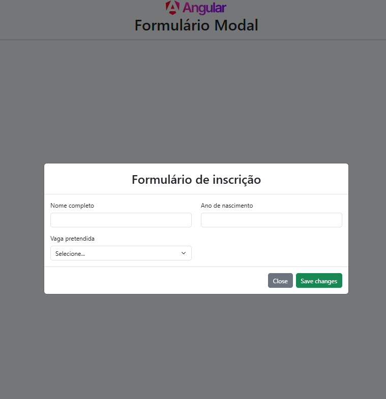

# Angular Modal

Esse projeto foi criado com  [Angular CLI](https://github.com/angular/angular-cli) versão 18.





## Tecnologias utilizadas
- [Angular](https://angular.dev/)
- [Bootstrap](https://getbootstrap.com/)


## Executando o projeto

Antes de seguir o passo a passo para executar o projeto na sua máquina, é necessário ter instalado os seguintes softwares:

- [Node.js](https://nodejs.org/en)
- [Angular](https://angular.io/)
- [Git](https://git-scm.com/downloads)

## Parte 1: 

1.1 - Clone o projeto

```bash
 Clone o projeto: https://github.com/rosantanasouza/angular-modal.git
```

1.2 - Entre no diretório do projeto

```bash
   cd angular-modal
```

1.3 - Instale as dependências locais do projeto

```bash
   npm install
```

1.4 - Execute o servidor local do Angular:
```bash
   npm run start
```    

1.5 - Abra seu navegador com o seguinte endereço para visualizar a aplicação em execução:
```bash
   http://localhost:4200/
```